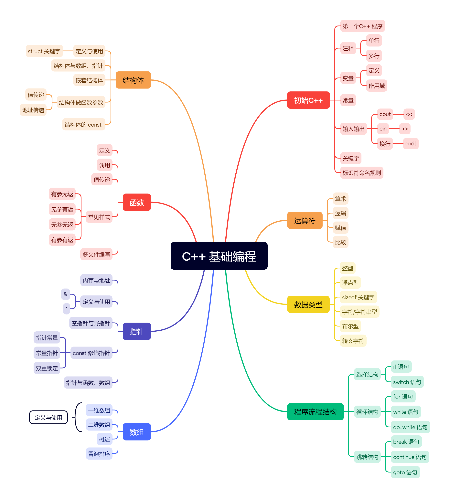
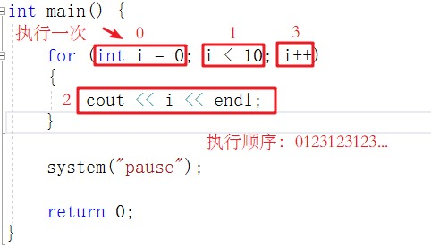

# C++ 基础编程



# 初始 C++

## 第一个C++ 程序

```c++
// 包含输入输出库
#include <iostream>

// 使用标准命名空间
using namespace std;

// 程序入口
int main() {
    // 输出 "Hello, World!" 并换行
    cout << "Hello, World!" << endl;
    
    // 成功结束
    return 0;
}
```

## 注释

### 单行注释

- 从 `//` 开始，直到这一行结束的所有内容，都会被当会被当做注释

```c++
//单行注释
```

### 多行注释

- 夹在这两个符号中间的所有内容，统统被当做注释

```C++
/*
多行
注释
*/
```

## 变量

### 变量是什么

> 变量（Variable）是计算机内存中一段已命名的存储空间

### 变量定义

```c++
数据类型 变量名 = 初始值;
```

### 示例

```c++
#include <iostream>
#include <string> // 如果要用 string 类型，最好加上这一行
using namespace std;

int main() {
    // 1. 制造盒子（定义变量）
    string name = "暗影刺客";  // 名字
    int level = 10;           // 等级
    double money = 99.5;      // 金币（可能有小数）
    char gender = 'M';        // 性别（M代表男，F代表女）
    bool isVip = true;        // 是否是VIP

    // 2. 把盒子里的东西拿出来看（输出变量）
    cout << "角色昵称：" << name << endl;
    cout << "当前等级：" << level << endl;
    cout << "拥有金币：" << money << endl;
    cout << "性别代码：" << gender << endl;
    cout << "VIP状态：" << isVip << endl; // 注意：true会输出1，false会输出0

    return 0;
}
```

### 变量作用域

1. 局部变量

在函数或一个代码块内部声明的变量，称为局部变量。它们只能被函数内部或者代码块内部的语句使用。

```c++
#include <iostream>
using namespace std;
 
int main ()
{
  // 局部变量声明
  int a, b;
  int c;
 
  // 实际初始化
  a = 10;
  b = 20;
  c = a + b;
 
  cout << c;
 
  return 0;
}
```

2. 全局变量

在所有函数外部定义的变量（通常是在程序的头部），称为全局变量。全局变量的值在程序的整个生命周期内都是有效的。

全局变量可以被任何函数访问。也就是说，全局变量一旦声明，在整个程序中都是可用的。

```c++
#include <iostream>
using namespace std;
 
// 全局变量声明
int g;
 
int main ()
{
  // 局部变量声明
  int a, b;
 
  // 实际初始化
  a = 10;
  b = 20;
  g = a + b;
 
  cout << g;
 
  return 0;
}
```

> 在程序中，局部变量和全局变量的名称可以相同，但是在函数内，局部变量的值会覆盖全局变量的值。

```c++
#include <iostream>
using namespace std;
 
// 全局变量声明
int g = 20;
 
int main ()
{
  // 局部变量声明
  int g = 10;
 
  cout << g;
 
  return 0;
}

//运行结果   10
```

3. 块作用域

是在代码块内部声明的变量：

```c++
#include <iostream>

int main() {
    int a = 10;
    {
        int a = 20;  // 块作用域变量
        std::cout << "块变量: " << a << std::endl;
    }
    std::cout << "外部变量: " << a << std::endl;
    return 0;
}

//运行结果
//块变量: 20
//外部变量: 10
```

>以上实例中，内部的代码块中声明了一个名为 a 的变量，它与外部作用域中的变量 a 同名。内部作用域中的变量 a 将覆盖外部作用域中的变量 a，在内部作用域中访问 a 时输出的是20，而在外部作用域中访问 a 时输出的是 10。

4. 类作用域

类作用域指的是在类内部声明的变量：

```c++
#include <iostream>

class MyClass {
public:
    static int class_var;  // 类作用域变量
};

int MyClass::class_var = 30;

int main() {
    std::cout << "类变量: " << MyClass::class_var << std::endl;
    return 0;
}

//运行结果   30
```

>以上实例中，MyClass 类中声明了一个名为 class_var 的类作用域变量。可以使用类名和作用域解析运算符 **::** 来访问这个变量。在 main() 函数中访问 class_var 时输出的是 30。

### 初始化局部变量和全局变量

当局部变量被定义时，系统不会对其初始化，您必须自行对其初始化。定义全局变量时，系统会自动初始化为下列值：

| 数据类型 | 初始化默认值 |
| :------: | :----------: |
|   int    |      0       |
|   char   |     '\0'     |
|  float   |      0       |
|  double  |      0       |
| pointer  |     NULL     |

## 常量

### 常量是什么

在计算机程序设计中，常量是一种具有**只读**属性 (Read-Only) 的数据实体。 一旦在**初始化** (Initialization) 阶段被赋予了特定的值，该值在程序的整个生命周期 (Lifecycle) 内都严格**禁止被修改**。

> 为什么要用常量：1.安全性 2.可读性

### 常量定义

1. `const` 关键字

```c++
const 数据类型 常量名 = 值;
```

>常量名全部使用大写

2. `#define` 宏定义

```c++
#define 常量名 值
```

>不需要指定数据类型，**后面绝对不能加分号**

### 示例

```c++
#include <iostream>  // 包含输入输出库

#define MAX_LEVEL 99  // 定义宏常量，无需分号

using namespace std;  // 使用标准命名空间

int main() {
    // 变量，可以修改
    int score = 0;
    score = 100;  // 没问题
    
    // 常量，必须初始化，不可修改
    const double PI = 3.14159;
    const int WEEK_DAYS = 7;
    
    // 输出宏常量
    cout << MAX_LEVEL << endl;
    
    // 返回成功
    return 0;
}
```

## 输入与输出

- `cout`: 用于输出（打印到屏幕）。
- `cin`: 用于输入（从键盘读取）。

### cout 输出

- 符号：`<<` (流插入运算符)
- 作用：箭头指向左边，表示把右边的数据“塞进” `cout` 里发出去

>进阶技巧：拼接可以用多个 `<<` 把文字和变量连起来像“串烧”一样打印。

```c++
int age = 18;

cout << "我今年 " << age << " 岁了。" << endl;
```

### cin 输入

- 符号：`>>` (流提取运算符)
- 作用：箭头指向右边，指向变量。表示把键盘敲的数据“拿出来”流进变量盒子里。

```c++
cin >> 变量名;
```

1. 必须先定义变量
2. 不能加 `endl`

### 示例

```c++
// 包含输入输出库
#include <iostream>
// 包含字符串库
#include <string>

// 使用标准命名空间
using namespace std;

// 程序入口
int main() {
    // 准备变量
    string name;
    int age;
    
    // 提示输入名字
    cout << "请输入你的名字：";
    // 读取名字
    cin >> name;
    
    // 提示输入年龄
    cout << "请输入你的年龄：";
    // 读取年龄
    cin >> age;
    
    // 输出问候
    cout << "你好，" << name << "！原来你已经 " << age << " 岁了。" << endl;
    
    // 成功结束
    return 0;
}
```

## 关键字

|     asm      |   else    |       new        |   this   |
| :----------: | :-------: | :--------------: | :------: |
|     auto     |   enum    |     operator     |  throw   |
|     bool     | explicit  |     private      |   true   |
|    break     |  export   |    protected     |   try    |
|     case     |  extern   |      public      | typedef  |
|    catch     |   false   |     register     |  typeid  |
|     char     |   float   | reinterpret_cast | typename |
|    class     |    for    |      return      |  union   |
|    const     |  friend   |      short       | unsigned |
|  const_cast  |   goto    |      signed      |  using   |
|   continue   |    if     |      sizeof      | virtual  |
|   default    |  inline   |      static      |   void   |
|    delete    |    int    |   static_cast    | volatile |
|      do      |   long    |      struct      | wchar_t  |
|    double    |  mutable  |      switch      |  while   |
| dynamic_cast | namespace |     template     |          |

## 标识符命名规则

### 命名规则

- 只能包含：字母 (`A-Z, a-z`)、数字 (`0-9`) 和 下划线 (`_`)
- 不能以数字开头
- 不能使用 C++ 的关键字
- 大小写非常敏感

### 命名风格

1. 小驼峰命名法 (lowerCamelCase) —— 推荐用于变量
2. 下划线命名法 (snake_case) —— C++ 标准库常用
3. 大驼峰命名法 (PascalCase) —— 通常用于类名 (Class)

# 数据类型

## 整型

|    **数据类型**     |                  **占用空间**                   |     取值范围     |
| :-----------------: | :---------------------------------------------: | :--------------: |
|    short(短整型)    |                      2字节                      | (-2^15 ~ 2^15-1) |
|      int(整型)      |                      4字节                      | (-2^31 ~ 2^31-1) |
|    long(长整形)     | Windows为4字节，Linux为4字节(32位)，8字节(64位) | (-2^31 ~ 2^31-1) |
| long long(长长整形) |                      8字节                      | (-2^63 ~ 2^63-1) |

### 有符号 vs 无符号

`signed` (默认)：可以存正数，也可以存负数。

- 比如 `int` 其实就是 `signed int`。
- 范围：-21亿 到 +21亿。

`unsigned` (无符号)：只能存非负数（0和正数）。

- 如果你确定这个数绝不可能是负的，可以用 `unsigned`。
- 好处：因为它不需要存负号，所以它能存的正数上限翻倍了！
- 范围：0 到 42亿。

## sizeof 关键字

```c++
sizeof(类型/变量)
```

> 利用sizeof关键字可以统计数据类型所占内存大小

```c++
int main() {
	cout << "short 类型所占内存空间为： " << sizeof(short) << endl;
	cout << "int 类型所占内存空间为： " << sizeof(int) << endl;
	cout << "long 类型所占内存空间为： " << sizeof(long) << endl;
	cout << "long long 类型所占内存空间为： " << sizeof(long long) << endl;

	return 0;
}
```

## 浮点型

- 作用：用于表示小数
- 浮点型变量分为两种：

1. 单精度float
2. 双精度double

- 两者的区别在于表示的有效数字范围不同。

| 数据类型 | 占用空间 |   有效数字范围   |
| :------: | :------: | :--------------: |
|  float   |  4字节   |   7位有效数字    |
|  double  |  8字节   | 15～16位有效数字 |

```c++
int main() {
	float f1 = 3.14f;
	double d1 = 3.14;
    
	cout << f1 << endl;
	cout << d1<< endl;

	cout << "float  sizeof = " << sizeof(f1) << endl;
	cout << "double sizeof = " << sizeof(d1) << endl;

	//科学计数法
	float f2 = 3e2; // 3 * 10 ^ 2 
	cout << "f2 = " << f2 << endl;

	float f3 = 3e-2;  // 3 * 0.1 ^ 2
	cout << "f3 = " << f3 << endl;
    
	return 0;
}
```

## 字符型

- 作用：字符型变量用于显示单个字符

```c++
char ch = 'a';
```

>在显示字符型变量时，用单引号将字符括起来，不要用双引号

>单引号是单个字符，双引号是字符串

- C和C++中字符型变量只占用1个字节。
- 字符型变量并不是把字符本身放到内存中存储，而是将对应的ASCII编码放入到存储单元

```c++
int main() {
	char ch = 'a';
	cout << ch << endl;
	cout << sizeof(char) << endl;
	//ch = "abcde"; //错误，不可以用双引号
	//ch = 'abcde'; //错误，单引号内只能引用一个字符

	cout << (int)ch << endl;  //查看字符a对应的ASCII码
	ch = 97; //可以直接用ASCII给字符型变量赋值
	cout << ch << endl;

	return 0;
}
```

## 转义字符

- 作用：用于表示一些不能显示出来的ASCII字符

| 转义字符 |                含义                 | ASCII码值（十进制） |
| :------: | :---------------------------------: | :-----------------: |
|    \a    |                警报                 |         007         |
|    \b    |   退格(BS) ，将当前位置移到前一列   |         008         |
|    \f    |  换页(FF)，将当前位置移到下页开头   |         012         |
|    \n    | 换行(LF) ，将当前位置移到下一行开头 |         010         |
|    \r    |  回车(CR) ，将当前位置移到本行开头  |         013         |
|    \t    | 水平制表(HT) （跳到下一个TAB位置）  |         009         |
|    \v    |            垂直制表(VT)             |         011         |
|    \\    |        代表一个反斜线字符""         |         092         |
|    ’     |     代表一个单引号（撇号）字符      |         039         |
|    "     |         代表一个双引号字符          |         034         |
|    ?     |            代表一个问号             |         063         |
|    \0    |                数字0                |         000         |
|   \ddd   |       8进制转义字符，d范围0~7       |      3位8进制       |
|   \xhh   | 16进制转义字符，h范围0~9，a~f，A~F  |      3位16进制      |

```c++
int main() {
	cout << "\\" << endl;
	cout << "\tHello" << endl;
	cout << "\n" << endl;

	return 0;
}
```

## 字符串型

- 作用：用于表示一串字符
- 两种定义方式

```c++
char 变量名[] = "字符串值"
```

```c++
int main() {
	char str1[] = "hello world";
	cout << str1 << endl;
    
	return 0;
}
```

>C风格的字符串要用双引号括起来

```c++
#include <string> //导入字符串类

string 变量名 = "字符串值"
```

```c++
#include <string>

int main() {
	string str = "hello world";
	cout << str << endl;
	
	return 0;
}
```

>C++风格字符串，需要加入头文件`#include<string>`

## 布尔类型 bool

作用：布尔数据类型代表真或假的值

bool类型只有两个值：

- true — 真（本质是1）
- false — 假（本质是0）

bool类型占1个字节大小

```c++
int main() {

	bool flag = true;
	cout << flag << endl; // 1

	flag = false;
	cout << flag << endl; // 0

	cout << "size of bool = " << sizeof(bool) << endl; //1
	

	return 0;
}
```

# 运算符

- 用于执行代码的运算

| **运算符类型** |                **作用**                |
| :------------: | :------------------------------------: |
|   算术运算符   |            用于处理四则运算            |
|   赋值运算符   |        用于将表达式的值赋给变量        |
|   比较运算符   | 用于表达式的比较，并返回一个真值或假值 |
|   逻辑运算符   |    用于根据表达式的值返回真值或假值    |

## 算术运算符

- 作用：用于处理四则运算

| 运算符 |    术语    |    示例     |   结果    |
| :----: | :--------: | :---------: | :-------: |
|   +    |    正号    |     +3      |     3     |
|   -    |    负号    |     -3      |    -3     |
|   +    |     加     |   10 + 5    |    15     |
|   -    |     减     |   10 - 5    |     5     |
|   *    |     乘     |   10 * 5    |    50     |
|   /    |     除     |   10 / 5    |     2     |
|   %    | 取模(取余) |   10 % 3    |     1     |
|   ++   |  前置递增  | a=2; b=++a; | a=3; b=3; |
|   ++   |  后置递增  | a=2; b=a++; | a=3; b=2; |
|   –    |  前置递减  | a=2; b=–a;  | a=1; b=1; |
|   –    |  后置递减  | a=2; b=a–;  | a=1; b=2; |

- ++a，先自己加了，在赋值
- a++，先赋值，在自己加

```c++
//加减乘除
int main() {

	int a1 = 10;
	int b1 = 3;

	cout << a1 + b1 << endl;
	cout << a1 - b1 << endl;
	cout << a1 * b1 << endl;
	cout << a1 / b1 << endl;  //两个整数相除结果依然是整数

	int a2 = 10;
	int b2 = 20;
	cout << a2 / b2 << endl; 

	int a3 = 10;
	int b3 = 0;
	//cout << a3 / b3 << endl; //报错，除数不可以为0


	//两个小数可以相除
	double d1 = 0.5;
	double d2 = 0.25;
	cout << d1 / d2 << endl;

	return 0;
}
```

```c++
//取模
int main() {

	int a1 = 10;
	int b1 = 3;

	cout << 10 % 3 << endl;

	int a2 = 10;
	int b2 = 20;

	cout << a2 % b2 << endl;

	int a3 = 10;
	int b3 = 0;

	//cout << a3 % b3 << endl; //取模运算时，除数也不能为0

	//两个小数不可以取模
	double d1 = 3.14;
	double d2 = 1.1;

	//cout << d1 % d2 << endl;

	system("pause");

	return 0;
}
```

```c++
//递增
int main() {

	//后置递增
	int a = 10;
	a++; //等价于a = a + 1
	cout << a << endl; // 11

	//前置递增
	int b = 10;
	++b;
	cout << b << endl; // 11

	//区别
	//前置递增先对变量进行++，再计算表达式
	int a2 = 10;
	int b2 = ++a2 * 10;
	cout << b2 << endl;

	//后置递增先计算表达式，后对变量进行++
	int a3 = 10;
	int b3 = a3++ * 10;
	cout << b3 << endl;

	return 0;
}
```

## 赋值运算符

- 作用：用于将表达式的值赋给变量

| **运算符** | **术语** |     **示例**      | **结果**  |
| :--------: | :------: | :---------------: | :-------: |
|     =      |   赋值   |     a=2; b=3;     | a=2; b=3; |
|     +=     |  加等于  |  a=0; a+=2;a=a+2  |   a=2;    |
|     -=     |  减等于  |  a=5; a-=3;a=a-3  |   a=2;    |
|     *=     |  乘等于  | a=2; a*=2;`a=a*5` |   a=4;    |
|     /=     |  除等于  |  a=4; a/=2;a=a/2  |   a=2;    |
|     %=     |  模等于  |  a=3; a%2;a=a%2   |   a=1;    |

```c++
int main() {

	//赋值运算符

	// =
	int a = 10;
	a = 100;
	cout << "a = " << a << endl;

	// +=
	a = 10;
	a += 2; // a = a + 2;
	cout << "a = " << a << endl;

	// -=
	a = 10;
	a -= 2; // a = a - 2
	cout << "a = " << a << endl;

	// *=
	a = 10;
	a *= 2; // a = a * 2
	cout << "a = " << a << endl;

	// /=
	a = 10;
	a /= 2;  // a = a / 2;
	cout << "a = " << a << endl;

	// %=
	a = 10;
	a %= 2;  // a = a % 2;
	cout << "a = " << a << endl;

	return 0;
}
```

## 比较运算符

- 作用：用于表达式的比较，并返回一个真值或假值

| **运算符** | **术语** | **示例** | **结果** |
| :--------: | :------: | :------: | :------: |
|     ==     |  相等于  |  4 == 3  |    0     |
|     !=     |  不等于  |  4 != 3  |    1     |
|     <      |   小于   |  4 < 3   |    0     |
|     >      |   大于   |  4 > 3   |    1     |
|     <=     | 小于等于 |  4 <= 3  |    0     |
|     >=     | 大于等于 |  4 >= 1  |    1     |

```c++
int main() {

	int a = 10;
	int b = 20;

	cout << (a == b) << endl; // 0 
	cout << (a != b) << endl; // 1
	cout << (a > b) << endl; // 0
	cout << (a < b) << endl; // 1
	cout << (a >= b) << endl; // 0
	cout << (a <= b) << endl; // 1

	return 0;
}
```

>C和C++ 语言的比较运算中， “真”用数字“1”来表示， “假”用数字“0”来表示。

## 逻辑运算符

- 作用：用于根据表达式的值返回真值或假值

| **运算符** | **术语** | **示例** |                         **结果**                         |
| :--------: | :------: | :------: | :------------------------------------------------------: |
|     !      |    非    |    !a    |       如果a为假，则!a为真； 如果a为真，则!a为假。        |
|     &&     |    与    |  a && b  |          如果a和b都为真，则结果为真，否则为假。          |
|    \|\|    |    或    | a \|\| b | 如果a和b有一个为真，则结果为真，二者都为假时，结果为假。 |

```c++
//逻辑运算符  --- 非
int main() {
	int a = 10;

	cout << !a << endl; // 0
	cout << !!a << endl; // 1

	return 0;
}
```

>真变假，假变真

```c++
//逻辑运算符  --- 与
int main() {

	int a = 10;
	int b = 10;

	cout << (a && b) << endl;// 1

	a = 10;
	b = 0;

	cout << (a && b) << endl;// 0 

	a = 0;
	b = 0;

	cout << (a && b) << endl;// 0

	return 0;
}

```

>逻辑与运算符总结： 同真为真，其余为假

```c++
//逻辑运算符  --- 或
int main() {

	int a = 10;
	int b = 10;

	cout << (a || b) << endl;// 1

	a = 10;
	b = 0;

	cout << (a || b) << endl;// 1 

	a = 0;
	b = 0;

	cout << (a || b) << endl;// 0

	return 0;
}
```

>逻辑或运算符总结： 同假为假，其余为真

# 程序流程结构

C/C++支持最基本的三种程序运行结构：顺序结构、选择结构、循环结构

- 顺序结构：程序按顺序执行，不发生跳转
- 选择结构：依据条件是否满足，有选择的执行相应功能
- 循环结构：依据条件是否满足，循环多次执行某段代码

## 选择结构

### if 语句

1. 单分支：`if`

- 满足条件就做，不满足就跳过

```c++
if (条件) {
    // 条件为真时，执行这里的代码
}
```

```c++
int score = 95;

if (score >= 60) {
    cout << "恭喜你，及格了！" << endl;
}
// 如果 score 是 50，上面的字就不会打印，程序直接往下走
```

2. 双分支：`if - else`

- 这是“非黑即白”的选择

```c++
if (条件) {
    // 方案 A
} else {
    // 方案 B (条件不满足时执行这里)
}
```

```c++
int money = 5;

if (money >= 10) {
    cout << "老板，来碗牛肉面！" << endl;
} else {
    cout << "钱不够，只能吃馒头了..." << endl;
}
```

3. 多分支：`else if`

- 当选择多于两个时使用

```c++
if (条件1) {
    // 满足条件1
} else if (条件2) {
    // 不满足条件1，但满足条件2
} else {
    // 上面统统不满足
}
```

```c++
int score = 85;

if (score >= 90) {
    cout << "优秀！" << endl;
} else if (score >= 80) {
    cout << "良好" << endl; // 85分会走进这里
} else if (score >= 60) {
    cout << "及格" << endl;
} else {
    cout << "补考吧少年" << endl;
}
```

4. 嵌套 `if`

- `if` 里面还可以再写 `if`。这叫嵌套。

```c++
if (今天下雨) {
    if (有伞) {
        cout << "打伞出门";
    } else {
        cout << "在家睡觉";
    }
} else {
    cout << "去公园玩";
}
```

>`=`和`==`：一个是赋值，一个是相等

### 三目运算符

- 可以把它看作是 `if-else` 的“缩写版”。

```c++
条件 ? 结果1 : 结果2;
```

- 执行逻辑：

1. `?` ：电脑先问“这个条件是真的吗？”
2. 如果真 (True)：就把 `:` 左边的值拿出来。
3. 如果假 (False)：就把 `:` 右边的值拿出来。

```c++
// 包含输入输出库
#include <iostream>

// 使用标准命名空间
using namespace std;

// 程序入口
int main() {
    int a = 10, b = 20;
    
    // 使用 if-else 语句（较啰嗦）
    int max1;
    if (a > b) {
        max1 = a;
    } else {
        max1 = b;
    }
    cout << "if-else: max = " << max1 << endl;  // 输出结果
    
    // 使用三元运算符（更简洁）
    int max2 = (a > b) ? a : b;
    cout << "三元运算符: max = " << max2 << endl;  // 输出结果
    
    // 成功结束
    return 0;
}
```

```c++
#include <iostream>
using namespace std;

int main() {
    int a = 10;
    int b = 20;
    int c = 0;

    // 1. 赋值操作
    c = (a > b) ? a : b;
    cout << "最大的数是：" << c << endl;

    // 2. 输出操作
    // 逻辑：如果 c 是 20，打印 "c是20"，否则打印 "c不是20"
    cout << (c == 20 ? "c是20" : "c不是20") << endl;

    return 0;
}
```

### switch 语句

- 执行多条件分支语句

```c++
switch (变量) {
    case 结果1:
        // 只有当 变量 == 结果1 时，执行这里
        break; //跳出 switch
        
    case 结果2:
        // 只有当 变量 == 结果2 时，执行这里
        break; 
        
    default:
        // 类似 else，如果上面都没匹配上，就执行这里
        break;
}
```

>1. 变量只能是：整型 (`int`, `long`...) 或字符型 (`char`)
>
>2. `case` 后面必须是常量
>3. `break`要加，不然会穿透

```c++
#include <iostream>
using namespace std;

int main() {
    int score;
    cout << "请给电影打分 (1-5)：";
    cin >> score;

    switch (score) {
        case 5:
            cout << "神作！必看！" << endl;
            break; // 如果不写这行，输入5会把下面4分的评价也打印出来
        case 4:
            cout << "推荐，很好看。" << endl;
            break;
        case 3:
            cout << "一般般，爆米花电影。" << endl;
            break;
        case 2:
            cout << "有点浪费时间。" << endl;
            break;
        case 1:
            cout << "烂片！退钱！" << endl;
            break;
        default:
            cout << "请输入正确的 1-5 分数！" << endl;
            break;
    }

    return 0;
}
```

## 循环结构

### for 循环

- 作用： 满足循环条件，执行循环语句

```c++
for (起始动作; 循环条件; 每次做完后的动作) {
    // 这里是循环体
    // 只要条件满足，这里的代码就会一直重复执行
}
```

- 经典写法

```c++
// 意思：让 i 从 0 开始，只要 i 小于 10，就执行一次，每次执行完 i 加 1
for (int i = 0; i < 10; i++) {
    cout << "这是第 " << i << " 次循环" << endl;
}
```

1. 简单的计数

```c++
// 打印 1 到 5
for (int i = 1; i <= 5; i++) {
    cout << i << " "; 
}
// 输出：1 2 3 4 5
```

2. 倒计时

```c++
// 发射倒计时
for (int i = 10; i > 0; i--) { // 注意这里是 i--
    cout << i << "... ";
}
cout << "发射！" << endl;
```

3. 跳着数

```c++
// 打印 10 以内的偶数 (0, 2, 4...)
for (int i = 0; i < 10; i += 2) { // 每次加 2
    cout << i << " ";
}
```

- 详情



### while 循环

- 作用：满足循环条件，执行循环语句

```c++
while (条件) {
    // 只要条件是真的 (true)，就一直执行这里
}
```

执行流程：

1. 判断：先看括号里的条件是不是真？
2. 执行：如果是真，执行 `{ }` 里的代码。
3. 回溯：执行完代码，回到第 1 步，再次判断条件。
4. 终止：一旦条件变成假，立刻跳出循环。

```c++
int i = 1; // 1. 起始动作（必须要在外面写）

while (i <= 5) { // 2. 循环条件
    cout << i << endl;
    i++; // 3. 步长更新（必须自己写在里面）
}
```

- 死循环

```c++
int i = 1;
while (i <= 5) {
    cout << "停不下来了！" << endl;
    // 完了，忘记写 i++ 了
    // i 永远是 1，永远小于 5，程序会一直疯狂打印
}
```

### do...while 循环

- `while` 循环：先判断，后执行
- `do...while` 循环：先执行，后判断

```c++
do {
    // 这里的代码，至少会被执行一次
    // ...
} while (条件); //注意添加分号
```

```c++
#include <iostream>
using namespace std;

int main() {
    int pwd;

    do {
        cout << "请输入密码(123456): ";
        cin >> pwd; // 先让你输一次

        if (pwd != 123456) {
            cout << "密码错误，请重试！" << endl;
        }

    } while (pwd != 123456); // 如果输错了，就回去再执行一遍

    cout << "解锁成功！" << endl; // 只有循环结束了才会走到这一步

    return 0;
}
```

执行步骤

Step 1: 直接跳进 `do` 里面的 `{ }`，执行代码。

Step 2: 遇到 `while (条件);`。

Step 3: 判断条件。

- True (真)->像回旋镖一样飞回 Step 1，再次执行。
- False (假)->往下走，循环结束。

## 跳转结构

### break 语句

作用: 用于跳出选择结构或者循环结构

break使用的时机：

- 出现在switch条件语句中，作用是终止case并跳出switch
- 出现在循环语句中，作用是跳出当前的循环语句
- 出现在嵌套循环中，跳出最近的内层循环语句

1. 找到东西就停

```c++
#include <iostream>
using namespace std;

int main() {
    for (int i = 1; i <= 100; i++) {
        cout << "正在找数字: " << i << endl;

        if (i == 5) {
            cout << "找到了！就是它！" << endl;
            break; //直接跳出 for 循环
        }
    }

    // break 跳出来后，会直接来到这里
    cout << "循环结束了。" << endl;
    return 0;
}
```

2. 破解死循环

```c++
#include <iostream>
using namespace std;

int main() {
    int count = 0;

    while (true) { // 条件永远为真，理论上是死循环
        cout << "跑圈中..." << endl;
        count++;

        if (count == 3) {
            cout << "累死了，不跑了！" << endl;
            break; // 只有这行代码能救你出循环
        }
    }
    
    return 0;
}
```

3. 嵌套循环

```c++
int main() {
	//在嵌套循环语句中使用break，退出内层循环
	for (int i = 0; i < 10; i++)
	{
		for (int j = 0; j < 10; j++)
		{
			if (j == 5)
			{
				break;
			}
			cout << "*" << " ";
		}
		cout << endl;
	}

	return 0;
}
```

### continue 语句

作用：在循环语句中，跳过本次循环中余下尚未执行的语句，继续执行下一次循环

1. 跳过不喜欢的数字

```c++
#include <iostream>
using namespace std;

int main() {
    for (int i = 1; i <= 10; i++) {
        
        // 检查：如果是 4，就跳过
        if (i == 4) {
            cout << "--- 跳过 4 ---" << endl;
            continue; //直接飞回 i++，不执行下面的打印了
        }

        cout << "数字：" << i << endl;
    }
    
    return 0;
}
```

>注意：在 `for` 循环里用 `continue` 很安全，因为它会跳去 `i++`。 但在 `while` 循环里，如果你把 `i++` 写在了 `continue` 的后面，就会引发死循环

### goto 语句

- 作用：可以无条件跳转语句
- 解释：如果标记的名称存在，执行到goto语句时，会跳转到标记的位置

```c++
标签名:  // 1. 定义一个标签（以冒号结尾）
    // ... 代码 ...

goto 标签名; // 2. 命令程序立刻飞去那个标签
```

1. 强行制造循环

```c++
#include <iostream>
using namespace std;

int main() {
    int i = 1;

    // 定义一个标签，就像在地图上插个旗
    start_loop: 

    cout << "i 是 " << i << endl;
    i++;

    if (i <= 5) {
        // 这就是 goto：直接飞回上面的 start_loop 标签处
        goto start_loop; 
    }

    cout << "循环结束" << endl;
    return 0;
}
```

```c++
int main() {
	cout << "1" << endl;
	goto FLAG;
	cout << "2" << endl;
	cout << "3" << endl;
	cout << "4" << endl;
	FLAG:
	cout << "5" << endl;
	system("pause");
	return 0;
}
```

>注意：在程序中不建议使用goto语句，以免造成程序流程混乱

# 数组

## 概述

### 为什么要用数组

- 没有数组时

```c++
int score1 = 85;
int score2 = 90;
int score3 = 76;
// ... 写到手断 ...
int score50 = 60;
```

- 有数组后

```c++
int scores[50]; // 一行代码，搞定50个位置
```

### 数组的规则

- 相同数据类型
- 内存连续
- 固定大小

### 下标 (Index) 

- 从0开始

|   内存位置   | 第1格 | 第2格 | 第3格 | 第4格 | 第5格 |
| :----------: | :---: | :---: | :---: | :---: | :---: |
| 下标 (Index) |   0   |   1   |   2   |   3   |   4   |
| 数据 (Value) |  10   |  20   |  30   |  40   |  50   |

## 一维数组

### 定义

一维数组定义的三种方式：

```c++
数据类型 数组名[数组长度];

数据类型 数组名[ 数组长度 ] = { 值1，值2 ...};

数据类型 数组名[ ] = { 值1，值2 ...};
```

```c++
// 1. 定义一个能存 10 个整数的数组
int myNumbers[10]; 

// 2. 定义并直接初始化
int primeNumbers[5] = {2, 3, 5, 7, 11};

// 3. 偷懒写法（电脑会自动数数）
// 电脑一看后面有3个数，就会自动把长度设为 3
int luckyNumbers[] = {8, 88, 888};
```

### 使用

通过下标`[]`来访问或修改数组里的东西

```c++
#include <iostream>
using namespace std;

int main() {
    // 定义一个只有 3 个格子的数组
    int arr[3] = {10, 20, 30};

    // 1. 访问数据 (读)
    cout << "第一个数字是: " << arr[0] << endl; // 输出 10
    cout << "第三个数字是: " << arr[2] << endl; // 输出 30

    // 2. 修改数据 (写)
    arr[1] = 99; // 把原来的 20 改成 99
    cout << "修改后中间的数字: " << arr[1] << endl;

    return 0;
}
```

### 示例

```c++
int main() {

	//定义方式1
	//数据类型 数组名[元素个数];
	int score[10];

	//利用下标赋值
	score[0] = 100;
	score[1] = 99;
	score[2] = 85;

	//利用下标输出
	cout << score[0] << endl;
	cout << score[1] << endl;
	cout << score[2] << endl;


	//第二种定义方式
	//数据类型 数组名[元素个数] =  {值1，值2 ，值3 ...};
	//如果{}内不足10个数据，剩余数据用0补全
	int score2[10] = { 100, 90,80,70,60,50,40,30,20,10 };
	
	//逐个输出
	//cout << score2[0] << endl;
	//cout << score2[1] << endl;

	//一个一个输出太麻烦，因此可以利用循环进行输出
	for (int i = 0; i < 10; i++)
	{
		cout << score2[i] << endl;
	}

	//定义方式3
	//数据类型 数组名[] =  {值1，值2 ，值3 ...};
	int score3[] = { 100,90,80,70,60,50,40,30,20,10 };

	for (int i = 0; i < 10; i++)
	{
		cout << score3[i] << endl;
	}

	return 0;
}
```

>总结1：数组名的命名规范与变量名命名规范一致，不要和变量重名

>总结2：数组中下标是从0开始索引

### 一维数组数组名

一维数组名称的用途：

1. 可以统计整个数组在内存中的长度
2. 可以获取数组在内存中的首地址

示例：

```c++
int main() {

	//数组名用途
	//1、可以获取整个数组占用内存空间大小
	int arr[10] = { 1,2,3,4,5,6,7,8,9,10 };

	cout << "整个数组所占内存空间为： " << sizeof(arr) << endl;
	cout << "每个元素所占内存空间为： " << sizeof(arr[0]) << endl;
	cout << "数组的元素个数为： " << sizeof(arr) / sizeof(arr[0]) << endl;

	//2、可以通过数组名获取到数组首地址
	cout << "数组首地址为： " << (int)arr << endl;
	cout << "数组中第一个元素地址为： " << (int)&arr[0] << endl;
	cout << "数组中第二个元素地址为： " << (int)&arr[1] << endl;

	//arr = 100; 错误，数组名是常量，因此不可以赋值


	system("pause");

	return 0;
}
```

>1. 注意：数组名是常量，不可以赋值
>
>2. 总结1：直接打印数组名，可以查看数组所占内存的首地址
>
>3. 总结2：对数组名进行sizeof，可以获取整个数组占内存空间的大小

### 冒泡排序

作用： 最常用的排序算法，对数组内元素进行排序

1. 比较相邻的元素。如果第一个比第二个大，就交换他们两个。
2. 对每一对相邻元素做同样的工作，执行完毕后，找到第一个最大值。
3. 重复以上的步骤，每次比较次数-1，直到不需要比较

示例： 将数组 { 4,2,8,0,5,7,1,3,9 } 进行升序排序

```c++
int main() {

	int arr[9] = { 4,2,8,0,5,7,1,3,9 };

	for (int i = 0; i < 9 - 1; i++)
	{
		for (int j = 0; j < 9 - 1 - i; j++)
		{
			if (arr[j] > arr[j + 1])
			{
				int temp = arr[j];
				arr[j] = arr[j + 1];
				arr[j + 1] = temp;
			}
		}
	}

	for (int i = 0; i < 9; i++)
	{
		cout << arr[i] << endl;
	}

	return 0;
}
```

## 二维数组

二维数组就是在一维数组上，多加一个维度。

### 定义

- 定义一维数组用一个 `[]`，定义二维数组当然要用 两个 `[]`。

二维数组定义的四种方式：

```c++
数据类型 数组名[ 行数 ][ 列数 ];

数据类型 数组名[ 行数 ][ 列数 ] = { {数据1，数据2 } ，{数据3，数据4 } };

数据类型 数组名[ 行数 ][ 列数 ] = { 数据1，数据2，数据3，数据4};

数据类型 数组名[ ][ 列数 ] = { 数据1，数据2，数据3，数据4};
```

>建议：以上4种定义方式，利用第二种更加直观，提高代码的可读性

|       |  第0列   |  第1列   |  第2列   |  第3列   |
| :---: | :------: | :------: | :------: | :------: |
| 第0行 | `[0][0]` | `[0][1]` | `[0][2]` | `[0][3]` |
| 第1行 | `[1][0]` | `[1][1]` | `[1][2]` | `[1][3]` |
| 第2行 | `[2][0]` | `[2][1]` | `[2][2]` | `[2][3]` |

```c++
int main() {

	//方式1  
	//数组类型 数组名 [行数][列数]
	int arr[2][3];
	arr[0][0] = 1;
	arr[0][1] = 2;
	arr[0][2] = 3;
	arr[1][0] = 4;
	arr[1][1] = 5;
	arr[1][2] = 6;

	for (int i = 0; i < 2; i++)
	{
		for (int j = 0; j < 3; j++)
		{
			cout << arr[i][j] << " ";
		}
		cout << endl;
	}

	//方式2 
	//数据类型 数组名[行数][列数] = { {数据1，数据2 } ，{数据3，数据4 } };
	int arr2[2][3] =
	{
		{1,2,3},
		{4,5,6}
	};

	//方式3
	//数据类型 数组名[行数][列数] = { 数据1，数据2 ,数据3，数据4  };
	int arr3[2][3] = { 1,2,3,4,5,6 }; 

	//方式4 
	//数据类型 数组名[][列数] = { 数据1，数据2 ,数据3，数据4  };
	int arr4[][3] = { 1,2,3,4,5,6 };

	return 0;
}
```

>总结：在定义二维数组时，如果初始化了数据，可以省略行数

### 二维数组数组名

- 查看二维数组所占内存空间
- 获取二维数组首地址

示例：

```c++
int main() {

	//二维数组数组名
	int arr[2][3] =
	{
		{1,2,3},
		{4,5,6}
	};

	cout << "二维数组大小： " << sizeof(arr) << endl;
	cout << "二维数组一行大小： " << sizeof(arr[0]) << endl;
	cout << "二维数组元素大小： " << sizeof(arr[0][0]) << endl;

	cout << "二维数组行数： " << sizeof(arr) / sizeof(arr[0]) << endl;
	cout << "二维数组列数： " << sizeof(arr[0]) / sizeof(arr[0][0]) << endl;

	//地址
	cout << "二维数组首地址：" << arr << endl;
	cout << "二维数组第一行地址：" << arr[0] << endl;
	cout << "二维数组第二行地址：" << arr[1] << endl;

	cout << "二维数组第一个元素地址：" << &arr[0][0] << endl;
	cout << "二维数组第二个元素地址：" << &arr[0][1] << endl;

	system("pause");

	return 0;
}
```

>总结1：二维数组名就是这个数组的首地址
>
>总结2：对二维数组名进行sizeof时，可以获取整个二维数组占用的内存空间大小

# 函数

## 概述

- 作用：将一段经常使用的代码封装起来，减少重复代码

- 一个较大的程序，一般分为若干个程序块，每个模块实现特定的功能。

## 函数的定义

函数的定义一般主要有5个步骤：

1、返回值类型

2、函数名

3、参数表列

4、函数体语句

5、return 表达式

```c++
返回值类型 函数名(参数列表) {
    //函数体语句
    return 结果; //返回结果
}
```

- 返回值类型 ：一个函数可以返回一个值。在函数定义中
- 函数名：给函数起个名称
- 参数列表：使用该函数时，传入的数据
- 函数体语句：花括号内的代码，函数内需要执行的语句
- return表达式： 和返回值类型挂钩，函数执行完后，返回相应的数据

```c++
//函数定义
int add(int num1, int num2)
{
	int sum = num1 + num2;
	return sum;
}
```

## 函数的调用

- 功能：使用定义好的函数

```c++
函数名(实参1, 实参2, ...);
```

1. 调用 `void` 函数

```c++
// 定义
void sayHi() {
    cout << "你好！" << endl;
}

// 调用
int main() {
    sayHi(); 
    // int x = sayHi(); // 错误
    return 0;
}
```

2. 用变量“接住”返回值

```c++
// 包含输入输出库
#include <iostream>
// 使用标准命名空间
using namespace std;

// 函数定义：计算两个整数的和
int add(int a, int b) {
    return a + b;
}

// 程序入口
int main() {
    // 调用函数并接收结果
    int sum = add(5, 10);
    
    // 输出结果
    cout << "和是：" << sum << endl;
    
    // 成功结束
    return 0;
}
```

3. 直接使用返回值

```c++
// 包含输入输出库
#include <iostream>
// 使用标准命名空间
using namespace std;

// 函数定义：计算两个整数的和
int add(int a, int b) {
    return a + b;
}

// 程序入口
int main() {
    // 直接在 cout 中调用函数
    // 先执行 add(2, 3) 得到 5，然后打印
    cout << add(2, 3) << endl;
    
    // 成功结束
    return 0;
}
```

>总结：函数定义里小括号内称为形参，函数调用时传入的参数称为实参

## 值传递

- 所谓值传递，就是函数调用时实参将数值传入给形参
- 值传递时，如果形参发生，并不会影响实参

> “形参只是实参在内存中的一份临时副本，两者的内存地址互不相关，因此修改形参不会产生副作用

```c++
#include <iostream>
using namespace std;

// 这个函数试图交换 num1 和 num2
void swap(int num1, int num2) {
    cout << "--- 函数内部开始交换 ---" << endl;
    int temp = num1;
    num1 = num2;
    num2 = temp;
    cout << "函数内部交换完成: num1=" << num1 << ", num2=" << num2 << endl; 
    // 在这里，num1 和 num2 确实换了
}

int main() {
    int a = 10;
    int b = 20;

    cout << "调用前: a=" << a << ", b=" << b << endl;

    // 调用交换函数
    swap(a, b);

    // 调用后
    cout << "调用后: a=" << a << ", b=" << b << endl;

    return 0;
}
```

运行结果：

```
调用前: a=10, b=20
--- 函数内部开始交换 ---
函数内部交换完成: num1=20, num2=10
调用后: a=10, b=20
```

>总结： 值传递时，形参是修饰不了实参的

## 函数的常见样式

常见的函数样式有4种

1. 无参无返
2. 有参无返
3. 无参有返
4. 有参有返

```c++
//函数常见样式
//1、 无参无返
void test01()
{
	//void a = 10; //无类型不可以创建变量,原因无法分配内存
	cout << "this is test01" << endl;
	//test01(); 函数调用
}

//2、 有参无返
void test02(int a)
{
	cout << "this is test02" << endl;
	cout << "a = " << a << endl;
}

//3、无参有返
int test03()
{
	cout << "this is test03 " << endl;
	return 10;
}

//4、有参有返
int test04(int a, int b)
{
	cout << "this is test04 " << endl;
	int sum = a + b;
	return sum;
}
```

## 函数的声明

作用：告诉编译器函数名称及如何调用函数。函数的实际主体可以单独定义。

- 函数的声明可以多次，但是函数的定义只能有一次

```c++
//声明可以多次，定义只能一次
//声明
int max(int a, int b);
int max(int a, int b);
//定义
int max(int a, int b)
{
	return a > b ? a : b;
}

int main() {

	int a = 100;
	int b = 200;

	cout << max(a, b) << endl;

	return 0;
}
```

## 函数的分文件编写

作用：让代码结构更加清晰

函数分文件编写一般有4个步骤

1. 创建后缀名为.h的头文件
2. 创建后缀名为.cpp的源文件
3. 在头文件中写函数的声明
4. 在源文件中写函数的定义

```c++
//swap.h文件
#include<iostream>
using namespace std;

//实现两个数字交换的函数声明
void swap(int a, int b);

```

```c++
//swap.cpp文件
#include "swap.h"

void swap(int a, int b)
{
	int temp = a;
	a = b;
	b = temp;

	cout << "a = " << a << endl;
	cout << "b = " << b << endl;
}
```

```c++
//main函数文件
#include "swap.h"
int main() {

	int a = 100;
	int b = 200;
	swap(a, b);

	system("pause");

	return 0;
}

```

## 函数写在哪?

- 这是一个关于 C/C++ 执行顺序 的重要规则：先定义，后使用。
- 编译器看代码是从上往下看的。如果在 `main` 函数里调用了一个它还没见过的函数，它会报错。

1. 方式一

```c++
//定义函数
void sayHi(){
    cout<<"Hi"<<endl;
} 

int main(){
    sayHi();
    return 0;
}
```

2. 方式二

```c++
//先声明
int max(int a, int b);

int main() {

	int a = 100;
	int b = 200;

	cout << max(a, b) << endl;

	return 0;
}

//定义
int max(int a, int b)
{
	return a > b ? a : b;
}
```

```c++
// 包含输入输出库
#include <iostream>

// 使用标准命名空间
using namespace std;

// 先定义函数（正确方式）
void sayHi() {
    cout << "Hi!" << endl;
}

// 程序入口
int main() {
    // 调用函数（编译通过，因为函数已定义）
    sayHi();
    
    // 以下是错误示例（但为了演示，注释掉）
    // sayHi(); // ❌ 报错！如果函数定义在 main 后，这里会找不到 sayHi
    
    // 成功结束
    return 0;
}

// 如果把函数定义放在 main 后，会导致调用时编译错误
// void sayHi() { cout << "Hi!" << endl; }  // ❌ 太晚定义
```

# 指针

## 概述

### 内存与地址

- 内存编号是从0开始记录的，一般用十六进制数字表示

- 地址是内存的唯一索引编号

```c++
int a = 10;
cout << "变量 a 的值是: " << a << endl;      // 输出: 10
cout << "变量 a 的地址是: " << &a << endl;     // 输出: 0x61ff0c (一串看不懂的十六进制数字)
```

### 指针是什么

- 可以利用指针变量保存地址

指针，本质上也是一个变量。 它很特殊，普通变量存的是“数字”或“文字”，而指针变量专门用来存地址。

## 指针的定义与使用

### 定义

```c++
数据类型 * 指针变量名;
```

```c++
int a = 10;

// 定义一个整型指针 p
int * p; 

// 让 p 保存 a 的地址（建立关联）
p = &a;

//int * p = &a;写一行
```

>`*`和数据类型有关，整型指针、字符串指针等

### 解引用 (*)

这是指针最强大的地方。 一旦 `p` 拿到了 `a` 的地址，`p` 就拥有了远程操控 `a` 的能力

- 读取：`*p`
- 修改：`*p = 20`

```c++
#include <iostream>
using namespace std;

int main() {
    int a = 10;
    int * p = &a; // p 指向了 a

    // 1. 读取数据
    cout << "a 的值: " << a << endl;
    cout << "*p 的值: " << *p << endl; // *p 相当于“a”

    // 2. 修改数据
    *p = 1000; //找到 p 指向的内存，把里面的 10 改成 1000

    cout << "修改后 a 的值: " << a << endl; // a 被远程修改了
    cout << "修改后 *p 的值: " << *p << endl;

    return 0;
}
```

指针变量和普通变量的区别

- 普通变量存放的是数据,指针变量存放的是地址
- 指针变量可以通过" `*` "操作符，操作指针变量指向的内存空间，这个过程称为解引用

>总结1： 我们可以通过 & 符号 获取变量的地址
>
>总结2：利用指针可以记录地址
>
>总结3：对指针变量解引用，可以操作指针指向的内存

## 指针所占内存空间

提问：指针也是种数据类型，那么这种数据类型占用多少内存空间？

```c++
int main() {

	int a = 10;

	int * p;
	p = &a; //指针指向数据a的地址

	cout << *p << endl; //* 解引用
	cout << sizeof(p) << endl;
	cout << sizeof(char *) << endl;
	cout << sizeof(float *) << endl;
	cout << sizeof(double *) << endl;

	return 0;
}
```

>总结：所有指针类型在32位操作系统下是4个字节，在64位操作系统下是8个字节

## 空指针与野指针

- **空指针**：指针变量指向内存中编号为0的空间
- **用途：**初始化指针变量
- **注意：**空指针指向的内存是不可以访问的

```c++
int * p = nullptr; //关键字 nullptr
```

```c++
int main() {

	//指针变量p指向内存地址编号为0的空间
	int * p = NULL;

	//访问空指针报错 
	//内存编号0 ~255为系统占用内存，不允许用户访问
	cout << *p << endl;
	return 0;
}
```

- **野指针**：指针变量指向非法的内存空间

```c++
int main() {

	//指针变量p指向内存地址编号为0x1100的空间
	int * p = (int *)0x1100;

	//访问野指针报错 
	cout << *p << endl;

	return 0;
}
```

```c++
int * p; // ❌ 错误！这时候 p 里的地址是随机的乱码
*p = 100; //极度危险！
```

>总结：空指针和野指针都不是我们申请的空间，因此不要访问。

## const 修饰指针

### 概述

- const修饰指针有三种情况

1. const修饰指针 — 常量指针
2. const修饰常量 — 指针常量
3. const即修饰指针，又修饰常量

>`const` 往右修饰，被修饰的东西就不能变，是指针就是常量指针，是常量就是指针常量

- 左定值，右定向

1. `const` 在 `*` 的左边->锁住值。
2. `const` 在 `*` 的右边->锁住向。
3. 两边都有->全锁死。

### 常量指针

关键点：`const` 在 `*` 左边

```c++
const int * p
    
int const * p
```

>内容不能改，但指针可以指别人

```c++
int a = 10;
int b = 20;

// 定义：指向常量的指针
const int * p = &a; 

// 1. 试图修改数据
// *p = 100; // 报错，因为 const 在 * 左边，值被锁了。

// 2. 试图修改指针指向
p = &b; // 没问题，现在指向 b。
```

### 指针常量

关键点：`const` 在 `*` 右边

```c++
int * const p
```

>指针不能指别人，但内容可以改

```c++
int a = 10;
int b = 20;

// 定义：指针本身是常量
int * const p = &a; 

// 1. 试图修改数据
*p = 100; // 没问题，a 变成了 100。

// 2. 试图修改指针指向
// p = &b; // 报错，因为 const 在 * 右边，指向被锁了。
```

### 双重锁定

关键点：两边都有 `const`

```c++
const int * const p
```

>既不能改指向，也不能改数据

```c++
int a = 10;
int b = 20;

const int * const p = &a;

// *p = 100; // 错！值不能改
// p = &b;   // 错！向不能改
```

## 指针和数组

- **作用：**利用指针访问数组中元素

1. 数组名其实就是一个指针

```c++
#include <iostream>
using namespace std;

int main() {
    int arr[5] = {1, 2, 3, 4, 5};

    cout << "arr 的值(地址):     " << arr << endl;
    cout << "&arr[0] 的值(地址): " << &arr[0] << endl;

    // 会发现这两个打印出来的十六进制数字是一模一样的
    return 0;
}
```

- `arr` 存储的是数组第一个元素的地址，即`arr` 等价于 `&arr[0]`

2. 指针的算术运算

```
内存地址： [1000]   [1004]   [1008]
数据：     [ 10 ]   [ 20 ]   [ 30 ]
指针 p：     ↑        ↑
            (p)     (p+1)
```

3. 用指针访问数组

```c++
int * p = arr;
```

| 你想拿的数据 | 数组下标写法 |  指针写法  |       原理解析        |
| :----------: | :----------: | :--------: | :-------------------: |
| 第 1 个元素  |   `arr[0]`   |    `*p`    |      直接解引用       |
| 第 2 个元素  |   `arr[1]`   | `*(p + 1)` | 地址往后挪1格，再取值 |
| 第 3 个元素  |   `arr[2]`   | `*(p + 2)` | 地址往后挪2格，再取值 |

4. 示例

```c++
int main() {

	int arr[] = { 1,2,3,4,5,6,7,8,9,10 };

	int * p = arr;  //指向数组的指针

	cout << "第一个元素： " << arr[0] << endl;
	cout << "指针访问第一个元素： " << *p << endl;

	for (int i = 0; i < 10; i++)
	{
		//利用指针遍历数组
		cout << *p << endl;
		p++;
	}

	return 0;
}
```

## 指针与函数

**作用：**利用指针作函数参数，可以修改实参的值

1. 值传递：改变形参，不改变实参
2. 地址传递：可以改变实参
3. 函数定义：`返回值类型 函数名 (int * p1,int * p2){}`
4. 函数调用：`函数名(&p1,&p2);`

```c++
//值传递
void swap1(int a ,int b)
{
	int temp = a;
	a = b; 
	b = temp;
}
//地址传递
void swap2(int * p1, int *p2)
{
	int temp = *p1;
	*p1 = *p2;
	*p2 = temp;
}

int main() {

	int a = 10;
	int b = 20;
	swap1(a, b); // 值传递不会改变实参

	swap2(&a, &b); //地址传递会改变实参

	cout << "a = " << a << endl;

	cout << "b = " << b << endl;

	return 0;
}
```

>总结：如果不想修改实参，就用值传递，如果想修改实参，就用地址传递

## 指针、数组、函数

案例描述：封装一个函数，利用冒泡排序，实现对整型数组的升序排序

例如数组：`int arr[10] = { 4,3,6,9,1,2,10,8,7,5 };`

```c++
//冒泡排序函数
void bubbleSort(int * arr, int len)  //int * arr 也可以写为int arr[]
{
	for (int i = 0; i < len - 1; i++)
	{
		for (int j = 0; j < len - 1 - i; j++)
		{
			if (arr[j] > arr[j + 1])
			{
				int temp = arr[j];
				arr[j] = arr[j + 1];
				arr[j + 1] = temp;
			}
		}
	}
}

//打印数组函数
void printArray(int arr[], int len)
{
	for (int i = 0; i < len; i++)
	{
		cout << arr[i] << endl;
	}
}

int main() {

	int arr[10] = { 4,3,6,9,1,2,10,8,7,5 };
	int len = sizeof(arr) / sizeof(int);

	bubbleSort(arr, len);

	printArray(arr, len);

	return 0;
}
```

>总结：当数组名传入到函数作为参数时，被退化为指向首元素的指针

# 结构体

## 结构体的基本概念

结构体是一种用户自定义的数据类型 (User-defined Data Type)。它将一组逻辑上相关联的、可能是不同类型的数据成员 (Member Variables)，封装在一个内存块中，通过一个统一的名字进行管理。

## 结构体定义和使用

### 结构体的定义

通常我们将结构体的定义写在 `main` 函数的上面，这样所有的函数都能使用它。

>定义结构体时的关键字是struct，不可省略

```c++
struct 结构体名 {
    数据类型 成员1;
    数据类型 成员2;
    // ... 可以有很多个
}; 
```

代码示例：手机数据模型

```c++
#include <iostream>
#include <string> // 用 string 一定要引头文件
using namespace std;

struct Phone {
    string brand;  // 品牌
    int price;     // 价格
    bool is5G;     // 是否支持5G
}; 
```

### 结构体的使用

1. 创建变量

有三种常见的创建方式，如下

- struct 结构体名 变量名
- struct 结构体名 变量名 = { 成员1值 ， 成员2值…}
- 定义结构体时顺便创建变量

>创建结构体变量时，关键字struct可以省略

```c++
int main() {
    // 方式 A：先创建，后赋值
    Phone myPhone; 
    myPhone.brand = "小米";
    myPhone.price = 3999;
    myPhone.is5G = true;

    // 方式 B：创建时直接初始化
    // 顺序必须和定义时一模一样：品牌 -> 价格 -> 5G
    Phone iphone = {"iPhone 15", 5999, true};

    // 方式 C：C++11 之后的列表初始化
    Phone huawei {"Mate 60", 6999, true};
    
    return 0;
}
```

2. 访问成员

点号运算符 `.`

```c++
// 修改数据
    iphone.price = 5500; // 降价了

    // 读取数据
    cout << "手机品牌: " << iphone.brand << endl;
    cout << "当前价格: " << iphone.price << endl;
```

3. 完整代码

```c++
#include <iostream>
#include <string>
using namespace std;

// 1. 定义结构体
struct Student {
    string name;
    int age;
    int score;
};

int main() {
    // 2. 创建变量
    Student s1 = {"张三", 18, 90};
    
    // 3. 也可以一个个赋值
    Student s2;
    s2.name = "李四";
    s2.age = 19;
    s2.score = 80;

    // 4. 输出看看
    cout << "第一位同学: " << s1.name << " 分数: " << s1.score << endl;
    cout << "第二位同学: " << s2.name << " 分数: " << s2.score << endl;

    // 5. 结构体之间的赋值
    // 把 s1 的所有数据直接拷贝给 s3
    Student s3 = s1; 
    cout << "s3 是 s1 的复制品: " << s3.name << endl;

    return 0;
}
```

## 结构体与数组

- 作用：将自定义的结构体放入到数组中方便维护
- 语法

```c++
struct 结构体名 {
    // ...
};

// 关键语法  struct可以省略
结构体名 数组名[元素个数] = {
    {成员1值, 成员2值...},  // 第 0 个元素
    {成员1值, 成员2值...},  // 第 1 个元素
    // ...
};
```

- 示例

```c++
//结构体定义
struct student
{
	//成员列表
	string name;  //姓名
	int age;      //年龄
	int score;    //分数
}

int main() {
	
	//结构体数组
	struct student arr[3]=
	{
		{"张三",18,80 },
		{"李四",19,60 },
		{"王五",20,70 }
	};

	for (int i = 0; i < 3; i++)
	{
		cout << "姓名：" << arr[i].name << " 年龄：" << arr[i].age << " 分数：" << arr[i].score << endl;
	}

	return 0;
}
```

- 访问成员

```c++
数组名[i].变量名

//arr[1].name = "小明";
```

## 结构体指针

**作用：**通过指针访问结构体中的成员

- 利用操作符 `-> `可以通过结构体指针访问结构体属性

### 定义结构体

步骤：

1. 先创建一个结构体变量。
2. 定义一个指针，类型是 `结构体名 *`。
3. 取地址 `&` 赋值给指针。

```c++
struct Student {
    string name;
    int age;
};

int main() {
    // 1. 先造个学生
    Student s = {"张三", 18};

    // 2. 再造个指针指向他
    // 翻译：定义一个指针 p，它专门指向 Student 类型的数据
    Student * p = &s; 
}
```

### 访问成员

1. 方法一

```c++
(*p).name
```

用 `*p` 解引用变成“实体 s”，然后再用点 `.` 访问

2. 方法二

通过指针，找到它指向的那个东西的成员

```c++
p->name = "李四"; 
```

## 结构体嵌套结构体

- 作用： 结构体中的成员可以是另一个结构体
- 例如：每个老师辅导一个学员，一个老师的结构体中，记录一个学生的结构体

### 如何定义

>被嵌套的结构体，必须先定义；即先定义小的结构体（学生），在定义大的结构体（老师）

```c++
#include <iostream>
#include <string>
using namespace std;

// 1. 先定义里面的小结构体
struct Student {
    string name; //姓名
    int age;     //年龄
    int score;   //分数
};

// 2. 再定义外面的大结构体
struct Teacher {
    int id; //职工编号
    string name;//姓名
    int age;//年龄
    struct Student stu;//子结构体 学生，struct可以省略
};
```

### 如何使用

1. 初始化

```c++
int main() {
    // 顺序：职工编号, 姓名, 年龄,{姓名,年龄,分数}
    Teacher t = {02, "张三", 29,{"李四", 16, 80}}; 
}
```

2. 访问成员

一层一层用 `.` (点) 进去

```c++
cout << "老师姓名: " << t.name << endl;
    
 // cout << t.score; // 报错，t 里没有 score，score 在 stu 里
cout << "学生分数: " << t.stu.score << endl;
```

### 示例

```c++
#include <iostream>
#include <string>
using namespace std;

// --- Step 1: 小结构体 (学生) ---
struct Student {
    string name;
    int score;
};

// --- Step 2: 大结构体 (老师) ---
struct Teacher {
    int id;        // 职工编号
    string name;   // 老师名字
    Student stu;   // 辅导的学生 (嵌套)
};

int main() {
    // --- Step 3: 创建并赋值 ---
    // 老师编号101, 叫老王, 他的学生叫小明, 分数90
    Teacher t = {101, "老王", {"小明", 90}};

    // --- Step 4: 访问数据 ---
    cout << "老师名字: " << t.name << endl;
    
    // 想要访问老师底下那个学生的名字
    cout << "辅导学生: " << t.stu.name << endl; 
    
    // 修改那个学生的分数
    t.stu.score = 100;
    cout << "学生新分: " << t.stu.score << endl;

    return 0;
}
```

## 结构体做函数参数

**作用：**将结构体作为参数向函数中传递

传递方式有两种：

- 值传递
- 地址传递

>总结：如果不想修改主函数中的数据，用值传递，反之用地址传递

### 值传递

场景：你只想让函数读取结构体里的数据，打印出来看看，不想让函数修改原件。

- 原理：函数会把整个结构体变量（里面的所有成员）全部复制一份。

```c++
#include <iostream>
#include <string>
using namespace std;

struct Student {
    string name;
    int age;
};

// 1. 值传递：参数直接写 Student s
// 这里 s 是 stu 的“克隆体”
void printStudent(Student s) {
    s.age = 100; // 试图搞破坏，修改年龄
    cout << "[函数内打印] 姓名: " << s.name << " 年龄: " << s.age << endl;
}

int main() {
    Student stu = {"张三", 18};

    printStudent(stu); // 传变量名

    // 验证：原件没变
    cout << "[main里打印] 姓名: " << stu.name << " 年龄: " << stu.age << endl;
    
    return 0;
}
```

运行结果

```
[函数内打印] 姓名: 张三 年龄: 100
[main里打印] 姓名: 张三 年龄: 18
```

### 地址传递

场景：你想让函数修改结构体里的数据，或者结构体太大了，你想为了省内存只传一个地址。

- 原理：传指针。不管结构体多大，指针永远只占 4 或 8 字节。

```c++
// 2. 地址传递：参数写 Student * s
// 这里 s 是指向 stu 的“指针”
void changeScore(Student * s) {
    // 使用箭头修改数据
    s->age = 20; 
}

int main() {
    Student stu = {"张三", 18};

    // 传地址：要加 &
    changeScore(&stu); 

    cout << "修改后的年龄: " << stu.age << endl; // 变成了 20
    return 0;
}
```

## 结构体中的 const

**作用：**用const来防止误操作

### 语法

```c++
// const 在 * 左边，表示“指针指向的内容是常量”
void 函数名(const 结构体名 * 指针名) {
    // 这里只能读，不能改
}
```

### 电商商品展示

```c++
#include <iostream>
#include <string>
using namespace std;

// 1. 定义商品结构体
struct Product {
    string name;  // 商品名
    double price; // 价格
    int stock;    // 库存
};

// 2. 定义展示函数
// 使用 const Product * p
// 含义：我接收一个商品地址，但我发誓只是看看，绝不改它
void showProduct(const Product * p) {
    cout << "--- 商品详情 ---" << endl;
    // 使用箭头 -> 读取数据
    cout << "品名: " << p->name << endl;
    cout << "价格: " << p->price << endl;

    //报错，无法修改
    // p->price = 9.9; 
    // p->stock = 0;  
}

int main() {
    // 创建一个商品
    Product phone = {"iPhone 15", 5999.0, 100};

    // 传地址进去
    showProduct(&phone);

    return 0;
}
```

### 示例2

```c++
//学生结构体定义
struct student
{
	//成员列表
	string name;  //姓名
	int age;      //年龄
	int score;    //分数
};

//const使用场景
void printStudent(const student *stu) //加const防止函数体中的误操作
{
	//stu->age = 100; //操作失败，因为加了const修饰
	cout << "姓名：" << stu->name << " 年龄：" << stu->age << " 分数：" << stu->score << endl;

}

int main() {

	student stu = { "张三",18,100 };

	printStudent(&stu);

	return 0;
}
```
